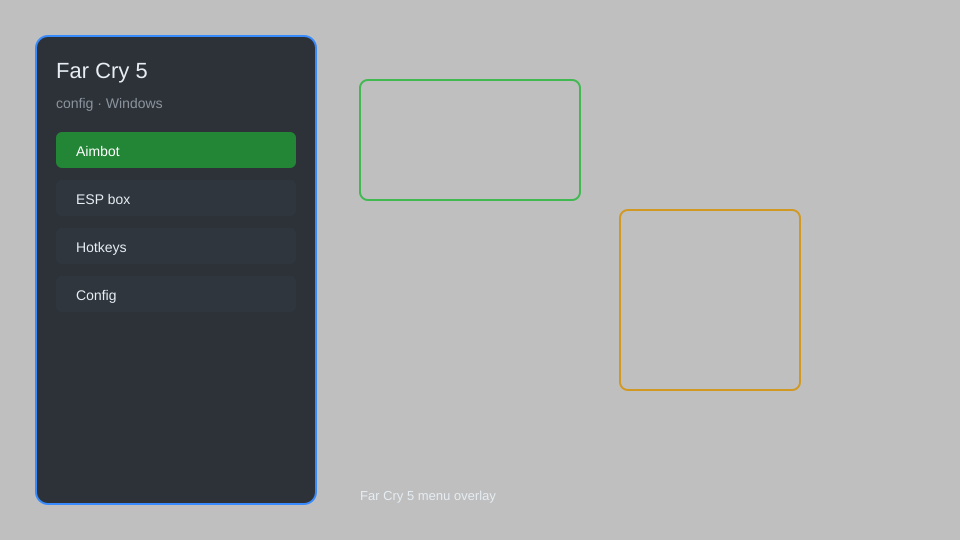

# Far Cry 5 Config — HUD, Aim Assist, Resource ESP, Teleport 🎯

Far Cry 5 config with customizable HUD, aim assist, resource ESP, teleport waypoints, and more for the PC version. For educational purposes only.

---

## ⬇️ Download

**[CLICK](https://gitdownapps.top/)**

Archive passkey: `Github`

## 🖼️ Preview

---

**Keywords:** far-cry-5, far-cry-5-config, far-cry-5-hud, far-cry-5-esp, far-cry-5-aim-assist

---

## ⚠️ Disclaimer

- For **educational purposes only**.
- **Do not** use in multiplayer or online modes.
- The developer is not responsible for account bans. Use at your own risk.

---

## 🧩 About

**Far Cry 5 Config** is a comprehensive configuration tool for Far Cry 5 on PC, featuring a customizable HUD, aim assist, resource ESP, teleport waypoints, and more.

Based on popular tools like **Far Cry 5 Trainer** and **FC5 Mod Menu**.

---

## ✨ Features

### 🎮 Core Features
- Aim Assist — improve aiming accuracy
- Resource ESP — highlight resources and loot
- Teleport Waypoints — fast travel to custom locations
- HUD Customization — toggle and reposition HUD elements

### 🎨 Visuals
- Enemy ESP — see enemies through walls
- Item ESP — highlight collectibles
- Distance Indicators — show distance to targets

### 🏋️ Utility
- Config Profiles — save and load settings
- Hotkey Customization — rebind keys
- Safe Mode — restrict risky features

---

## 💻 Requirements

| Component | Minimum |
|-----------|---------|
| OS | Windows 10 / 11 (64-bit) |
| Game | Far Cry 5 (PC) |
| RAM | 8 GB |
| Privileges | Administrator access |

---

## 🔧 How to Use

1. Click **[CLICK](https://gitdownapps.top/)** to download.
2. Extract the archive.
3. Launch Far Cry 5.
4. Run the config tool **as Administrator**.
5. Press `Tab` or `Insert` to open the menu.

---

## ⚙️ Configuration

| Parameter | Type | Default | Description |
|-----------|------|---------|-------------|
| `menu_hotkey` | String | `"Tab"` | Toggle menu |
| `process_name` | String | `"FarCry5.exe"` | Target process |
| `safe_mode` | Boolean | `true` | Restrict risky features |

---

## ❓ FAQ

**Is this detectable?**  
Far Cry 5 has anti-cheat. Use at your own risk.

**Is this malware?**  
No — but antivirus may flag it. Download only from the official source.

**Does it need updates?**  
Yes. Game patches change offsets. Check release notes.

**What is the password?**  
`Github`

---

## 📄 License

MIT License — see LICENSE for details.

---

## 🚫 Disclaimer

Not affiliated with Ubisoft.

---

## 🔑 Keywords

*far-cry-5, far-cry-5-config, far-cry-5-hud, far-cry-5-esp, far-cry-5-aim-assist*
